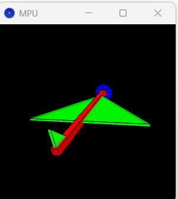

# Embedded Systems Project - Assignment 1

## Overview

This repository contains the necessary files to collect and simulate data from an MPU 6050 sensor using an Arduino and Python scripts.

## Folder Structure

- `collect_data/`
  - `MPU.ino`: Arduino sketch to send readings of the MPU 6050 sensor via the serial port.
  - `collect_mpu_data.py`: Python script to read the serial data from the Arduino and generate a `.csv` file.
- `simulation/`
  - Contains files to simulate the readings on a plane drawing.

## Usage

1. **Collecting Data:**

   - Upload the `MPU.ino` sketch to your Arduino.
   - Connect the MPU 6050 sensor to the Arduino.
   - Run the `collect_mpu_data.py` script to read the sensor data and generate a `.csv` file.

2. **Simulating Data:**
   - Use the file **MPU.pde** in the `simulation` folder to simulate the readings on a plane drawing.

## Simulation Output



## Requirements

- Arduino IDE
- Python 3.x
- Libraries: `pyserial`

## Installation

1. Clone the repository:
   ```sh
   git clone [https://github.com/kirobaghdad/Embedded-Systems-Project.git]
   ```
2. Install the required Python libraries:
   ```sh
   pip install pyserial
   ```
